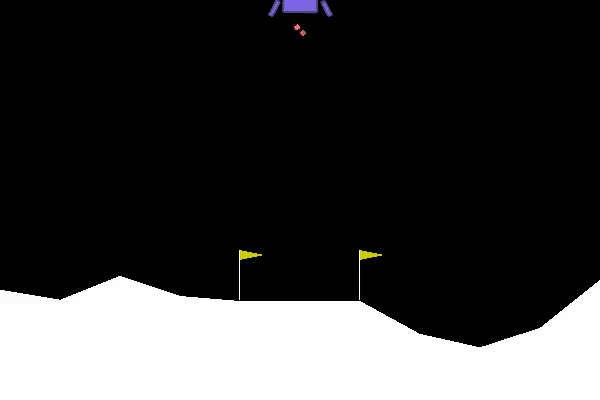
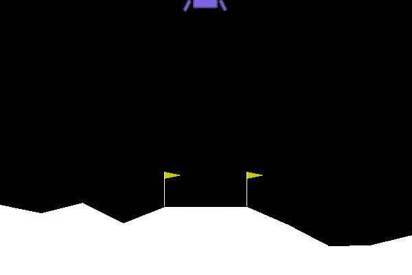
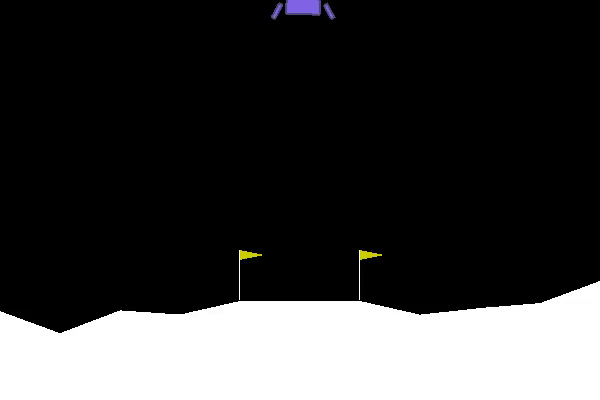
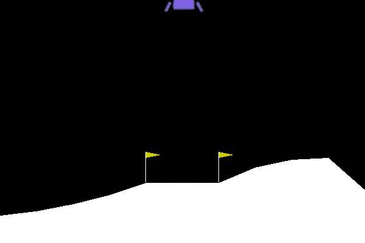

# Deep Inverse Q-learning LunarLander


#### Policy after 1000 updates reward of - 600

#### Policy after 5000 updates reward of - 126

#### Policy after 9000 updates reward of - 15.2

#### Policy after 15000 updates reward of 253



### Introduction

This implementation is based on  Deep Inverse Q-learning with Constraints

Arxiv : [https://arxiv.org/abs/2008.01712](https://arxiv.org/abs/2008.0171)

Blog Post: [http://nrprojects.cs.uni-freiburg.de/foundations.html#inverse](http://nrprojects.cs.uni-freiburg.de/foundations.html#inverse)

Using the Inverse Q-Learning on vector states 
Evaluation on the LunarLander enviroment from open ai gym
The expert samples are generated for an policy that solved the problem with an reward at least 200 

### Getting Started
### Instructions
1. Clone the repository and navigate to the downloaded folder.
```	
     git clone https://github.com/ChrisProgramming2018/IQL_Lunar_Lander.git
     cd IQL_Lunar_Lander 
```	
2. Create a conda enviroment 
```	
     conda create -n iql python=3.7
```
3. Activate the Enviroment
```
	conda activate iql
```
4.  **Install all dependencies**, use the requirements.txt file

```
	pip3 install -r requirements.txt
```

