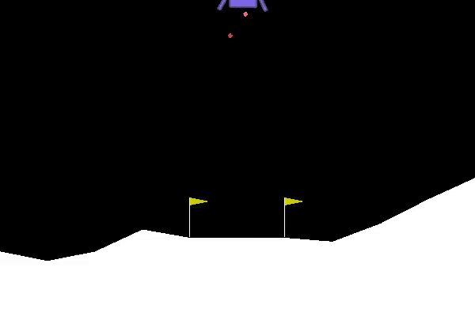
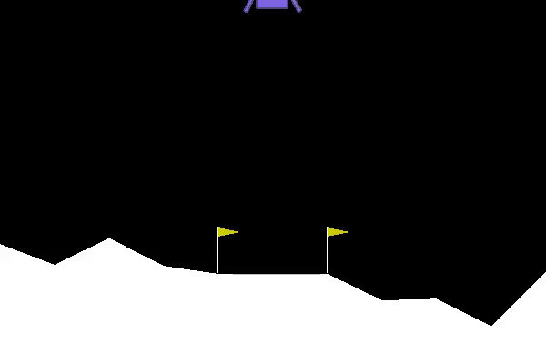
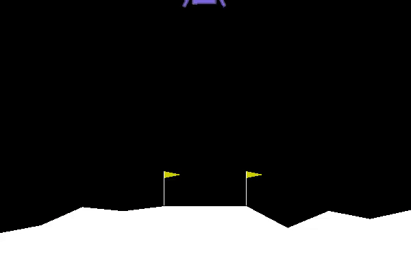

# Deep Inverse Q-learning  

This is an Implementaion from 


Arxiv : [https://arxiv.org/abs/2008.01712](https://arxiv.org/abs/2008.01712)

Blog Post: [http://nrprojects.cs.uni-freiburg.de/foundations.html#inverse](http://nrprojects.cs.uni-freiburg.de/foundations.html#inverse)


## Requirements

To install requirements:

```setup
pip install -r requirements.txt
```

>📋 Please use Python 3.7. 


#### 1. Collect trajectories with trained Agent 


#### 2. Train Lunar Lander IQL


## Results








